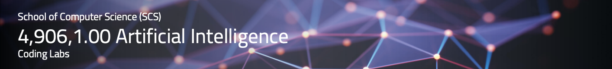

Welcome Spring Semester 2025 students to our course **Artificial Intelligence**, taught by **Prof. Dr. Damian Borth**.

Lectures, exercise sheets and hands-on lab courses alternate to provide a better learning experience in this course. The materials for Artificial Intelligence labs are available and accessible through this repository.

The lab content is based on [Python](https://www.python.org), [Jupyter Notebook](https://jupyter.org) and [PyTorch](https://pytorch.org). This repository is supported by the course TAs [Konstantinos Tzevelekakis](https://ics.unisg.ch/the-institute/about-us/team/detail/person-id/a83aef88-deb5-4fda-a878-2e6fd091a1ce/), [Julius Schulte](https://ics.unisg.ch/the-institute/about-us/team/detail/person-id/d5a6c2e4-76cc-4ae5-aba2-f90244dd8c9d/) and [Joëlle Hanna](https://ics.unisg.ch/the-institute/about-us/team/detail/person-id/9e40cd45-138b-4934-a7f1-ec52b815e443/).

Happy Coding!

## Course Logistics

- **Lectures:** Fridays 10:15-12:00PM CET, Zoom links are posted on Canvas.
- **Exercises and Labs:** Mondays 2:15-3:45PM CET, Zoom links are posted on Canvas.

<!-- - **Labs Office Hours:** Thursdays 2:00-3:00PM CET ([Joëlle Hanna](https://www.alexandria.unisg.ch/entities/person/Joelle_Hanna/indicators)) or Tuesdays 11:00-12:00PM CET ([Hamed Hemati](https://www.alexandria.unisg.ch/entities/person/Hamed_Hemati/indicators)), please send us a corresponding invitation via mail. -->
- **Announcements:** All course-related announcements and questions will happen on Canvas.

## Course Code Lab Notebooks 

This table lists all lab sessions incl. the launchers of the corresponding notebooks. In order to start the notebooks in the respective cloud environment just click on the to corresponding launchers. We aim to upload each lab notebook the day before the lab respectively.

| Date                    | Lab        |  Content                         |  CoLab                 |
|:-----------------------:|:--------------:|:---------------------------------|:-------------------------------:|
| Mon, Feb. 24           | **Lab 1**   | Intro / Python Recap I         |  |
|            |    | NumPy         |  |
|           |    | PyTorch         |  |
| Mon, Mar. 17            | **Lab 2**   | Search |  |
| Mon, Apr. 21            | **Lab 3**   | Naive Bayes    |  |
|             |    |  KNN     |  |
| Mon, May 05            | **Lab 4**   | Neural Networks     |  |
| Mon, May 19            | **Lab 5**   | CNN    | |

## Running the Course Code Lab Notebooks using Google Colab Environment ()

You just have to click the Colab badge next to the Notebooks below. All you need is a Google login
(e.g., your login information for gmail) and you can use this service at no charge.
Two advantages of Colab are that (1) you can save your
Notebooks directly into your Google Drive and read data from there, and (2) Google provides you with some limited GPU capabilities
free of charge (this will be an interesting feature for the coding challenge.)

If you need help running Python and/or Jupyter Notebooks, please don't hesitate to contact us (see below)!

## Questions?

Please use the Canvas forum for course related questions. For external enquiries, emergencies, or personal matters that you don't wish to put in a forum post, you can email us via: `aiml (minus) teaching ( dot ) ics ( at ) unisg ( dot ) ch`.
